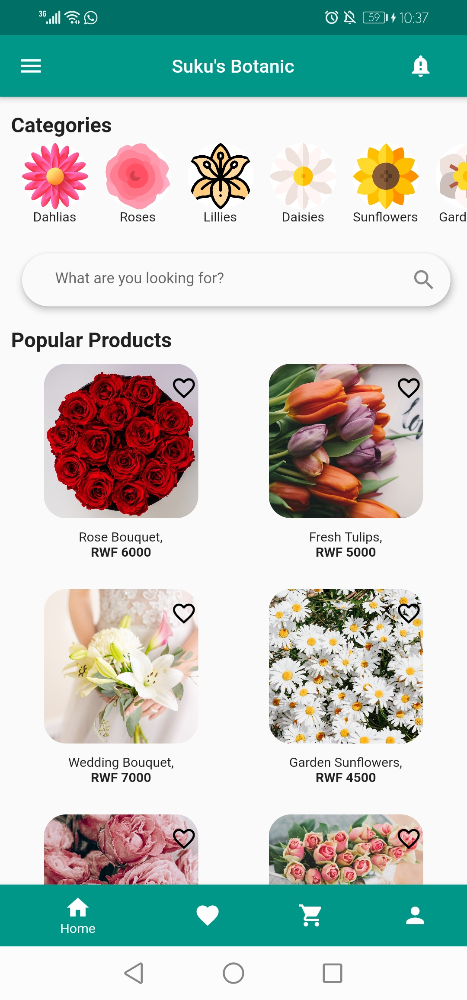
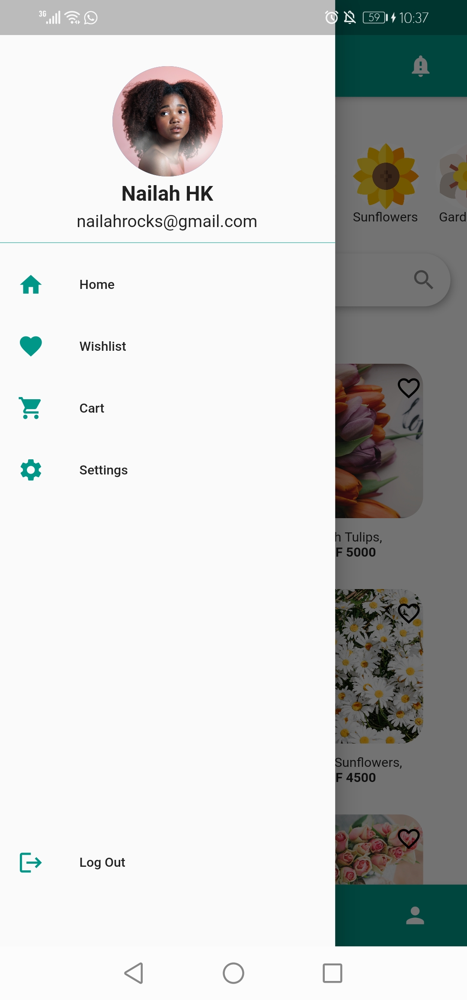
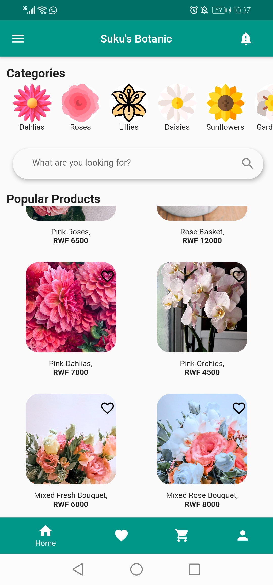
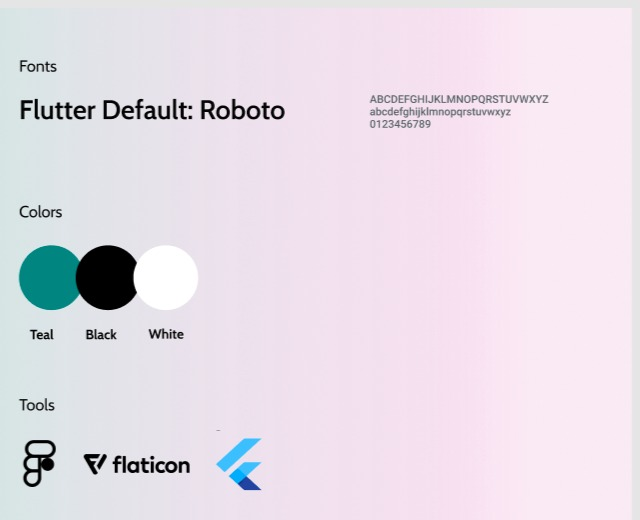

# Mini-Project1
Assignment Goals:
The objective of this assignment is for you to create beautiful apps faster with Flutter’s collection of the visual, structural, platform, and interactive widgets.
Your task is to create an Android/IoS flutter UI App that lets you shop (do a purchase or make a sale). Your app should have at least the following:
- Title bar with the name of the app
- Flutter Widgets such as scrolling, navigation, icons, fonts, etc.
- Since this is a simple UI template, a single page is expected which shows a list of products, prices, and categories is an added value

# PROCESS
In this assignment, I was able to implement and use the following widgets and elements to create my app; Classes, ListViews, GridViews, Cards, Columns, Rows, Dividers, Avatars and many other OOP elements.

In addition to the content covered through to week 3, the following were some of the sources I used to achieve my ideal UI.

# Sources:
Guiding Tutorials:
1. Drawer - https://www.youtube.com/watch?v=zVTV7F0Bme4
https://www.yourowncodes.com/how-to-add-images-icons-circle-avatar-in-flutter-application/
2. Bottom NavBar - https://www.youtube.com/watch?v=elLkVWt7gRM

Images:
https://unsplash.com/

Icons:
Flaticon

# NOTES:
- To run this app, make sure flutter run is being run from the Ziithe_MiniProject1_Wk3 Directory
- My application was run and tested on an Android 6.15-Inch Screen as well as on a pixel3 Android Emulator; renderflow errors may therefore occur on some smaller screens .

Below are some screenshots of the Application:

# Main Landing Page:

# Drawer:

# Scrolling View:

# Design Grid:

# By Ziithe Ewen Hiwa